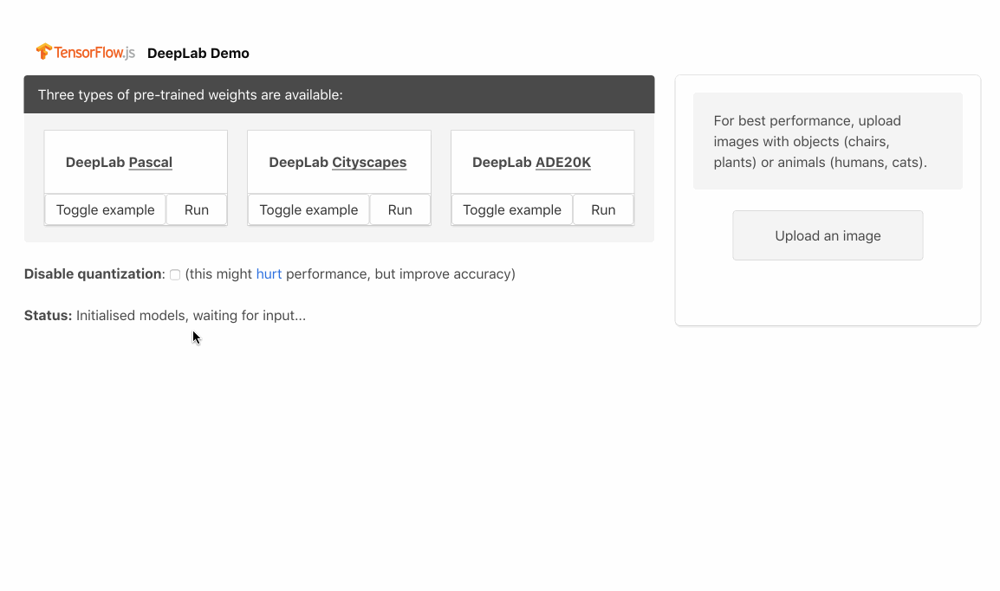

# Semantic Segmentation in the Browser: DeepLab v3 Model

## This model is a work-in-progress and has not been released yet. We will update this README when the model is released and usable

This package contains a standalone implementation of the DeepLab inference pipeline, as well as a [demo](./demo), for running semantic segmentation using TensorFlow.js.



## Usage

In the first step of semantic segmentation, an image is fed through a pre-trained model [based](https://github.com/tensorflow/models/blob/master/research/deeplab/g3doc/model_zoo.md) on MobileNet-v2. Three types of pre-trained weights are available, trained on [Pascal](http://host.robots.ox.ac.uk/pascal/VOC/voc2012/index.html), [Cityscapes](https://www.cityscapes-dataset.com) and [ADE20K](https://groups.csail.mit.edu/vision/datasets/ADE20K/) datasets.

To get started, pick the model name from `pascal`, `cityscapes` and `ade20k`, and decide whether you want your model quantized to 2 bytes. Then, initialize the model as follows:

```typescript
import {load} from '@tensorflow-models/deeplab';
const model = 'pascal';   // set to your preferred model, out of `pascal`, `cityscapes` and `ade20k`
const isQuantized = true; // set to your preference
const modelPromise = load(model, isQuantized);
```

This will load the weights and return the promise of a `SemanticSegmantation` object.

If you require more careful control over the initialization, you can use the `SemanticSegmantation` object on its own:

```typescript
import {SemanticSegmentation} from '@tensorflow-models/deeplab';
const model = 'pascal';   // set to your preferred model, out of `pascal`, `cityscapes` and `ade20k`
const isQuantized = true; // set to your preference
const deeplab = new SemanticSegmentation(model, isQuantized);
deeplab.load().then(() => {console.log("DeepLab is ready!")}); // load the weights
```


### Segmenting an Image

The `segment` method of the `SemanticSegmentation` object covers most use cases.

Each model recognises a different set of object classes in an image:

- [PASCAL](./deeplab/src/config.ts#L60)
- [CityScapes](./deeplab/src/config.ts#L66)
- [ADE20K](./deeplab/src/config.ts#L72)

You can use the `getLabels` method to obtain the colormap corresponding to the base model:

```typescript
import { getLabels } from '@tensorflow-models/deeplab';
const model = 'ade20k';
const colormap = getLabels(model);
```

#### `model.segment` input

- **image** :: `ImageData | HTMLImageElement | HTMLCanvasElement | HTMLVideoElement | tf.Tensor3D`;

The image to segment

- **canvas** (optional) :: `HTMLCanvasElement`

Pass an optional canvas element as `canvas` to draw the output as a side effect.

#### `model.segment` output

The output is a promise of a `DeepLabOutput` object, with four attributes:

- **legend** :: `{ [name: string]: [number, number, number] }`

The legend is a dictionary of objects recognized in the image and their colors in RGB format.

- **height** :: `number`

The height of the returned segmentation map

- **width** :: `number`

The width of the returned segmentation map

- **segmentationMap** :: `Uint8ClampedArray`

The colored segmentation map as `Uint8ClampedArray` which can be [fed](https://developer.mozilla.org/en-US/docs/Web/API/Canvas_API/Tutorial/Pixel_manipulation_with_canvas) into `ImageData` and mapped to a canvas.

#### `model.segment` example

```typescript
const classify = async (image) => {
    return await model.segment(image);
}
```

**Note**: *For more granular control, consider `segment` and `toSegmentationImage` methods described below.*

### Producing a Semantic Segmentation Map

To segment an arbitrary image and generate a two-dimensional tensor with class labels assigned to each cell of the grid overlayed on the image (with the maximum number of cells on the side fixed to 513), use the `segment` method of the `SemanticSegmentation` object.

#### `model.predict` input

- **image** :: `ImageData | HTMLImageElement | HTMLCanvasElement | HTMLVideoElement | tf.Tensor3D`;

The image to segment

#### `model.predict` output

- **rawSegmentationMap** :: `Promise<tf.Tensor2D>`

The segmentation map of the image

#### `model.predict` example

```javascript
const getSemanticSegmentationMap = async (image) => {
    return await model.predict(image)
}
```

### Translating a Segmentation Map into the Color-Labelled Image

To transform the segmentation map into a coloured image, use the `toSegmentationImage` method of the `SemanticSegmentation` object.

#### `model.toSegmentationImage` input

- **segmentationMap** :: `tf.Tensor2D`

The segmentation map of the image

- **canvas** (optional) :: `HTMLCanvasElement`

Pass an optional canvas element as `canvas` to draw the output as a side effect.

#### `model.toSegmentationImage` output

The returned promise is the future of a `SegmentationData` object that contains two attributes:

- **legend** :: `{ [name: string]: [number, number, number] }`

The legend is a dictionary of objects recognized in the image and their colors.

- **segmentationMap** :: `Uint8ClampedArray`

The colored segmentation map as `Uint8ClampedArray` which can be [fed](https://developer.mozilla.org/en-US/docs/Web/API/Canvas_API/Tutorial/Pixel_manipulation_with_canvas) into `ImageData` and mapped to a canvas.

#### `model.toSegmentationImage` example

```javascript
const translateSegmentationMap = async (segmentationMap) => {
    return await model.toSegmentationImage(segmentationMap)
}
```

## Contributing to the Demo

Please see the demo [documentation](./demo/README.md).

## Technical Details

This model is based on the TensorFlow [implementation](https://github.com/tensorflow/models/tree/master/research/deeplab) of DeepLab v3. You might want to inspect the [conversion script](./scripts/convert_deeplab.sh), or download original pre-trained weights [here](https://github.com/tensorflow/models/blob/master/research/deeplab/g3doc/model_zoo.md). To convert the weights locally, run the script as follows, replacing `dist` with the target directory:

```bash
./scripts/convert_deeplab.sh dist
```
