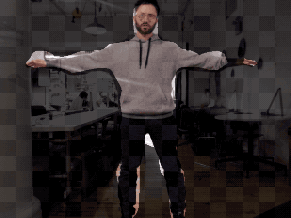

# Person Segmentation in the Browser

This package contains a standalone model called PersonSegmentation, as well as some demos, for running real-time person and body part segmentation in the browser using TensorFlow.js.

[Try the demo here!](https://storage.googleapis.com/tfjs-models/demos/person-segmentation/camera.html)


This model can be used to segment an image into pixels that are and are not part of a person, and into
pixels that belong to each of twenty-four body parts.  It works for a single person, and its ideal use case is for when there is only one person centered in an input image or video.  It can be combined with a person
detector to segment multiple people in an image by first cropping boxes for each detected person then estimating segmentation in each of those crops, but that responsibility is currently outside of the scope of this model.

To keep track of issues we use the [tensorflow/tfjs](https://github.com/tensorflow/tfjs) Github repo.

## Installation

You can use this as standalone es5 bundle like this:

```html
  <script src="https://cdn.jsdelivr.net/npm/@tensorflow/tfjs@0.13.3"></script>
  <script src="https://cdn.jsdelivr.net/npm/@tensorflow-models/person-segmentation@0.0.1"></script>
```

Or you can install it via npm for use in a TypeScript / ES6 project.

```sh
npm install @tensorflow-models/person-segmentation
```

## Usage

Either a person or part of the body can be segmented in an image.
Each methodology has similar input parameters with different outputs.

### Loading a pre-trained PersonSegmenation Model

In the first step of segmentation, an image is fed through a pre-trained model.  PersonSegmentation **comes with a few different versions of the model,** each corresponding to a MobileNet v1 architecture with a specific multiplier. To get started, a model must be loaded from a checkpoint, with the MobileNet architecture specified by the multiplier:

```javascript
const net = await personSegmentation.load(multiplier);
```

#### Inputs

* **multiplier** - An optional number with values: `1.0`, `0.75`, or `0.50`, `0.25`. Defaults to `0.75`.   It is the float multiplier for the depth (number of channels) for all convolution operations. The value corresponds to a MobileNet architecture and checkpoint.  The larger the value, the larger the size of the layers, and more accurate the model at the cost of speed.  Set this to a smaller value to increase speed at the cost of accuracy.

**By default,** PersonSegmenation loads a model with a **`0.75`** multiplier.  This is recommended for computers with **mid-range/lower-end GPUS.**  A model with a **`1.00`** muliplier is recommended for computers with **powerful GPUS.** A model with a **`0.50`** or **`0.25`** architecture is recommended for **mobile.**

### Person Segmentation

Person segmentation segments an image into pixels that are and aren't part of a person.
It returns a binary array with 1 for the pixels that are part of the person, and 0 otherwise. The array size corresponds to the number of pixels in the image.




```javascript
const net = await personSegmentation.load();

const segmentation = await personSegmentation.estimatePersonSegmentation(image, flipHorizontal, outputStride, segmentationThreshold);
```

#### Inputs

* **image** - ImageData|HTMLImageElement|HTMLCanvasElement|HTMLVideoElement
  The input image to feed through the network.
* **flipHorizontal** - Defaults to false.  If the pixels should be flipped/mirrored  horizontally.  This should be set to true for videos where the video is by default flipped horizontally (i.e. a webcam), and you want the poses to be returned in the proper orientation.
* **outputStride** - the desired stride for the outputs when feeding the image through the model.  Must be 32, 16, 8.  Defaults to 16.  The higher the number, the faster the performance but slower the accuracy, and visa versa.
* **segmetationTreshold** - Must be between 0 and 1. For each pixel, the model estimates a score between 0 and 1 that indicates how confident it is that part of a person is displayed in that pixel.  This *segmentationThreshold* is used to convert these values
to binary 0 or 1s by determining the minimum value a pixel's score must have to be considered part of a person.  In essence, a higher value will create a tighter crop
around a person but may result in some pixels being that are part of a person being excluded from the returned segmentation mask.

#### Returns

A binary array with 1 for the pixels that are part of the person, and 0 otherwise. The array size corresponds to the number of pixels in the image.

#### Example Usage

##### via Script Tag

```html
<html>
  <head>
    <!-- Load TensorFlow.js -->
    <script src="https://cdn.jsdelivr.net/npm/@tensorflow/tfjs@0.13.3"></script>
    <!-- Load PersonSegmentation -->
    <script src="https://cdn.jsdelivr.net/npm/@tensorflow-models/person-segmentation@0.0.1"></script>
 </head>

  <body>
    
  </body>
  <!-- Place your code in the script tag below. You can also use an external .js file -->
  <script>
    var outputStride = 16;
    var flipHorizontal = false;
    var segmentationThreshold = 0.5;

    var imageElement = document.getElementById('cat');

    personSegmentation.load().then(function(net){
      return net.estimatePersonSegmentation(imageElement, flipHorizontal, outputStride, segmentationThreshold)
    }).then(function(segmentation){
      console.log(segmentation);
    })
  </script>
</html>
```

###### via NPM

```javascript
import * as personSegmentation from '@tensorflow-models/person-segmentation';

const outputStride = 16;
const flipHorizontal = false;
const segmentationThreshold = 0.5;

const imageElement = document.getElementById('cat');

// load the PersonSegmentation model from a checkpoint
const net = await personSegmentation.load();

const segmentation = await net.estimatePersonSegmentation(imageElement, flipHorizontal, outputStride, segmentationThreshold);

console.log(segmentation);

```

which would produce the output:

```javascript
Uint8Array(307200) [0, 0, 0, 0, 0, 0, 0, 0, 0, 0, 0, 0, 0, 1, 1, 1, 0, 0, 0, 0, 0, 0, 0, 0, 0, 0, 0, 0, 0, 0, 0, 1, 1, 1, 1, 0, 0, 0, 0, 0, 0, 0, 0, 0, 0, 0, 0, 0, 0, 0, 0, 0, 0, 0, 0, 0, 0, 0, 0, 0, 0, 0, 1, 1, 1, 1, 1, 1, 1, 1, 0, 0, 0, 0, 0, 0, 0, 0, 0, 0, 0, 0, 0, 0, 0, 0, 0, 0, 0, 0, 0, 0, 0, 0, 0, 1, 1, 1, 0, …]
]
// an array of 307200 values are returned, one for each pixel of the 640x480 image that was passed to the function.
```

An example of applying a [bokeh effect](https://www.nikonusa.com/en/learn-and-explore/a/tips-and-techniques/bokeh-for-beginners.html) can be seen by running the [demo](https://storage.googleapis.com/tfjs-models/demos/person-segmentation/camera.html):


### Body Part Segmentation

Body part segmentation segments an image into pixels that are part of one of twenty-four body parts of a person, and to those that are not part of a person.
It returns an array with a part id from 0-24 for the pixels that are part of a corresponding body part, and -1 otherwise. The array size corresponds to the number of pixels in the image.


```javascript
const net = await personSegmentation.load();

const partSegmentation = await net.estimatePartSegmentation(image, flipHorizontal, outputStride, segmentationThreshold);
```

#### Inputs

* **image** - ImageData|HTMLImageElement|HTMLCanvasElement|HTMLVideoElement
  The input image to feed through the network.
* **flipHorizontal** - Defaults to false.  If the pixels should be flipped/mirrored  horizontally.  This should be set to true for videos where the video is by default flipped horizontally (i.e. a webcam), and you want the poses to be returned in the proper orientation.
* **outputStride** - the desired stride for the outputs when feeding the image through the model.  Must be 32, 16, 8.  Defaults to 16.  The higher the number, the faster the performance but slower the accuracy, and visa versa.
* **segmetationTreshold** - Must be between 0 and 1. For each pixel, the model estimates a score between 0 and 1 that indicates how confident it is that part of a person is displayed in that pixel.  In part segmentation, this *segmentationThreshold* is used to convert these values
to binary 0 or 1s by determining the minimum value a pixel's score must have to be considered part of a person, and clips the estimated part ids for each pixel by setting their values to -1 if the corresponding mask pixel value had a value of 0. In essence, a higher value will create a tighter crop
around a person but may result in some pixels being that are part of a person being excluded from the returned part segmentation.

#### Returns

An array with a part id from 0-24 for the pixels that are part of a corresponding body part, and -1 otherwise. The array size corresponds to the number of pixels in the image.

#### Example Usage

##### via Script Tag

```html
<html>
  <head>
    <!-- Load TensorFlow.js -->
    <script src="https://cdn.jsdelivr.net/npm/@tensorflow/tfjs@0.13.3"></script>
    <!-- Load PersonSegmentation -->
    <script src="https://cdn.jsdelivr.net/npm/@tensorflow-models/person-segmentation@0.0.1"></script>
 </head>

  <body>
    
  </body>
  <!-- Place your code in the script tag below. You can also use an external .js file -->
  <script>
    var outputStride = 16;
    var flipHorizontal = false;
    var segmentationThreshold = 0.5;

    var imageElement = document.getElementById('cat');

    personSegmentation.load().then(function(net){
      return net.estimatePartSegmentation(imageElement, flipHorizontal, outputStride, segmentationThreshold)
    }).then(function(partSegmentation){
      console.log(partSegmentation);
    })
  </script>
</html>
```

###### via NPM

```javascript
import * as personSegmentation from '@tensorflow-models/person-segmentation';

const outputStride = 16;
const flipHorizontal = false;
const segmentationThreshold = 0.5;

const imageElement = document.getElementById('cat');

// load the person segmentation model from a checkpoint
const net = await personSegmentation.load();

const segmentation = await net.estimatePartSegmentation(imageElement, flipHorizontal, outputStride, segmentationThreshold);

console.log(segmentation);

```

which would produce the output:

```javascript
Float32Array(307200) [-1, -1, -1, -1, -1, -1, -1, -1, -1, -1, -1, -1, -1, -1, -1, -1, -1, -1, -1, -1, 3, 3, 3, 3, -1, -1, -1, -1, -1, -1, -1, -1, -1, -1, -1, -1, -1, -1, -1, 0, 0, 0, 0, 0, 1, 1, 2, -1, -1, -1, -1, -1, -1, -1, -1, -1, -1, -1, -1, -1, -1, -1, -1, -1, -1, 15, 15, 15, 15, 16, 16, -1, -1, -1, -1, -1, -1, -1, -1, -1, -1, -1, -1, -1, -1, -1, -1, -1, -1, 23, 23, 23, 22, 22, -1, -1, -1, -1,  
…]
// an array of 307200 values are returned, one for each pixel of the 640x480 image that was passed to the function.
```

## Developing the Demos

Details for how to run the demos are included in the `demos/` folder.
